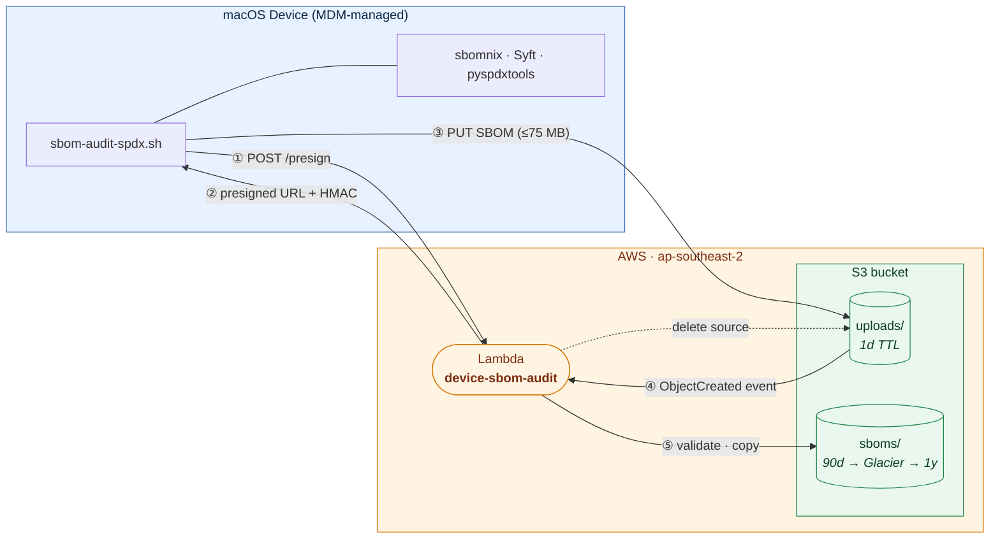
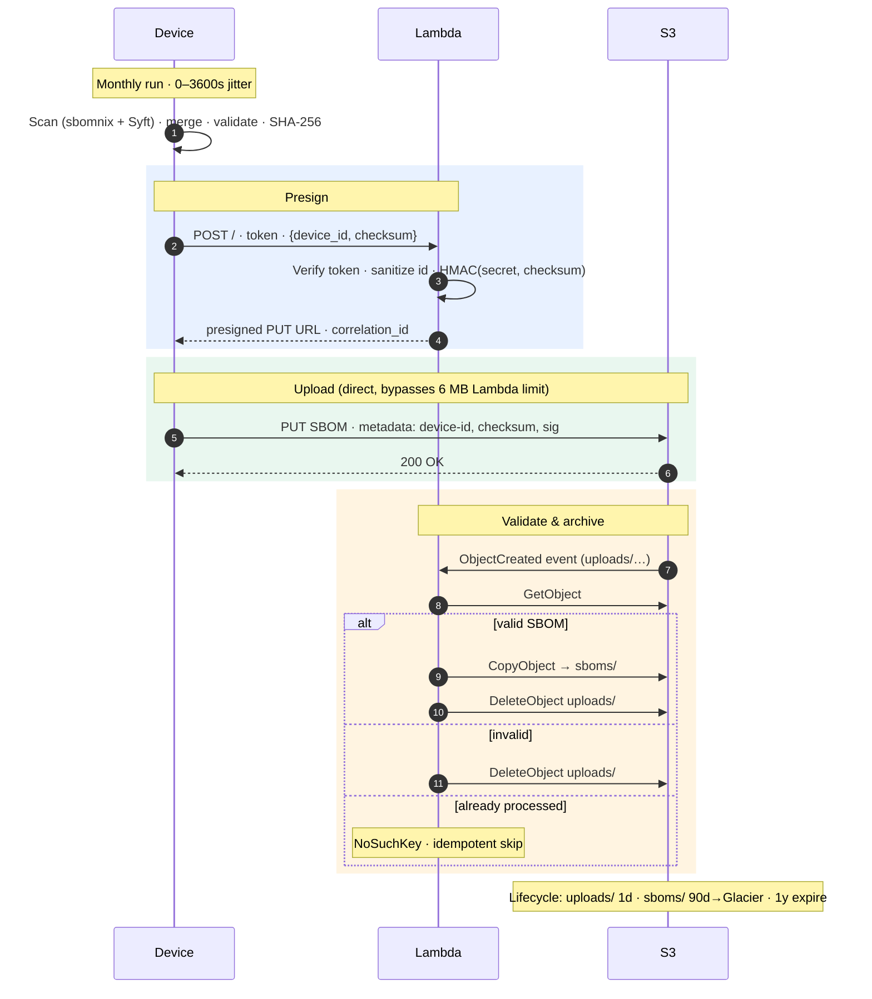

# Automated Device SBOM Collection (SPDX Format)

Monthly automated SBOM collection from macOS developer machines in SPDX 2.3 format. Devices scan the Nix profile (via [sbomnix](https://github.com/tiiuae/sbomnix)) and every package manager [Syft](https://github.com/anchore/syft) supports — Homebrew, pip/pipx, npm/yarn/pnpm, Go modules, Cargo, Ruby gems, Java/Maven, Cocoapods, and others — validate locally, then upload to Lambda + S3 with schema validation.

**TL;DR:** Bash script on devices → Lambda presign → S3 upload → Lambda validation → Long-term storage

---

## Table of Contents

- [What You Get](#what-you-get)
- [System Architecture](#system-architecture)
- [Prerequisites](#prerequisites)
- [Deployment](#deployment)
  - [Quick deploy (Terraform — recommended)](#quick-deploy-terraform--recommended)
  - [Cleanup](#cleanup)
- [Manual deployment (CLI walkthrough — reference)](#manual-deployment-cli-walkthrough--reference)
  - [1. Create S3 Bucket](#1-create-s3-bucket)
  - [2. Deploy Lambda Function](#2-deploy-lambda-function)
  - [3. Deploy to Devices](#3-deploy-to-devices-via-mdm)
  - [4. Verify Deployment](#4-verify-deployment)
- [How It Works](#how-it-works)
- [Script Usage](#script-usage)
- [Authentication & Security](#authentication--security)
- [SPDX Compatibility & Validation](#spdx-compatibility--validation)
- [Monitoring](#monitoring)
- [Production Rollout](#production-rollout)
- [Troubleshooting](#troubleshooting)
- [Advanced Configuration](#advanced-configuration)
- [API Reference](#api-reference)

---

## What You Get

**Coverage:**
- 4,500+ packages per device (Nix profile + every ecosystem [Syft](https://github.com/anchore/syft) recognises — Homebrew, pip/pipx, npm/yarn/pnpm, Go modules, Cargo, Ruby gems, Java/Maven, Cocoapods, Swift PM, Terraform providers, and more)
- ~3.5 MB SBOM files (typical developer machine)
- ~5 minute scan time (scans known package manager directories rather than the whole filesystem)
- Monthly automated collection, no user interaction needed
- Auto-installs all dependencies (Homebrew, Syft, sbomnix, pyspdxtools)

**SPDX 2.3 Native:**
- Full SPDX format throughout (generation → validation → storage)
- Compatible with https://tools.spdx.org/app/convert/ for XLSX export
- Passes both pyspdxtools and online converter validation
- Embedded schema validation (no external dependencies)

**Operational properties:**
- 75 MB file support via presigned S3 URLs (bypasses Lambda 6MB limit)
- Defence-in-depth validation (on-device + server-side)
- S3 lifecycle policies (90-day Glacier, 1-year expiration)
- CloudWatch logging for all validation events

---

## System Architecture

### High-Level Architecture



### Detailed Data Flow



**Data Flow Summary:**
1. Device waits 0-3600s (random delay to distribute load across fleet)
2. Device requests presigned S3 URL from Lambda (includes device ID + checksum)
3. Lambda generates HMAC signature and returns presigned URL (30min expiry)
4. Device uploads SBOM directly to S3 `uploads/` prefix with metadata
5. S3 event triggers Lambda to validate SBOM
6. Lambda verifies HMAC signature, checksum, and SPDX schema
7. Valid SBOMs → moved to `sboms/` with encryption, invalid → deleted
8. Lifecycle policies: `uploads/` cleaned after 1 day, `sboms/` archived to Glacier at 90 days, deleted at 1 year

---

## Prerequisites

### Infrastructure (AWS)
- AWS account (security/compliance account)
- AWS CLI v2 with appropriate credentials
- Go 1.24+ (for building Lambda binary; `go.mod` declares `go 1.24`)
- IAM permissions: Lambda, S3, IAM roles, CloudWatch, SNS

### Devices (macOS)
- macOS (tested Sonoma, Sequoia, Tahoe)
- Bash 3.2+ (macOS default `/bin/bash`)
- Nix with flakes enabled
- Homebrew or Workbrew (auto-installed if missing)
- Outbound HTTPS to Lambda + S3
- **Device hostname must start with `AS`** (e.g., `AS-laptop-123`) - enforced by Lambda

### MDM (Required)

An MDM solution capable of:
- Custom script execution
- Environment variable distribution
- Daily scheduling (the script self-throttles to monthly)

The script is MDM-agnostic — it should work with any MDM solution that supports the three capabilities above.

### Auto-Installed Dependencies
The script auto-installs these tools if missing (requires Homebrew):
- `jq` - JSON processing (Homebrew)
- `coreutils` - GNU utilities including numfmt for size formatting (Homebrew, macOS only)
- `syft` - System package scanning (Homebrew)
- `sbomnix` - Nix package scanning (`nix profile`)
- `pyspdxtools` - SPDX validation (pipx; auto-detects `~/.local/bin` if not in PATH)

**Note:** Homebrew/Workbrew is now **required** (not optional). Script will fail if Homebrew cannot be installed or is not already present.

---

## Deployment

> **Use the Terraform path below for any new or routine deployment.** The detailed manual CLI walkthrough that follows is kept for reference and one-off operations only — every resource it describes is provisioned by `terraform apply`.

### Quick deploy (Terraform — recommended)

> **Configure before applying.** Throughout this README, `<your-sbom-bucket>` is a placeholder for the S3 bucket name you choose. Bucket names are globally unique, so the Terraform default (`device-sbom-audit.example.com`) is just a placeholder that will fail to create. Override it with a name your org owns:
>
> ```bash
> # Either pass on the command line each time:
> terraform apply -var 's3_bucket_name=device-sbom-audit.security.your-domain.com'
>
> # Or create terraform.tfvars (gitignored) with your values:
> cat > terraform.tfvars <<'EOF'
> s3_bucket_name              = "device-sbom-audit.security.your-domain.com"
> lambda_reserved_concurrency = 10
> alert_email                 = "secops@your-domain.com"
> EOF
> ```
>
> Anywhere the README shows `<your-sbom-bucket>` or `<your-alerts-email>` in a command, substitute your actual value.

```bash
cd terraform/
terraform init
terraform plan          # review the diff
terraform apply
```

This builds the Lambda binary, packages the zip, and provisions every AWS resource described in this README:

- S3 bucket with encryption, versioning, lifecycle (1 day uploads / 90 day Glacier / 1 year), Public Access Block, BucketOwnerEnforced, and a defence-in-depth bucket policy
- Separate `-access-logs` bucket capturing S3 server access logs (90 day expiry)
- Lambda function (Linux ARM64, reserved concurrency 0 or 10 set by the required `lambda_reserved_concurrency` variable) + Function URL
- IAM role (`device-sbom-audit-lambda-role`) with least-privileged S3 + Secrets Manager grants
- Two Secrets Manager secrets (`device-sbom-audit/auth-token`, `device-sbom-audit/presign-secret`)
- CloudWatch log group at `/aws/lambda/device-sbom-audit`, KMS-encrypted with a customer-managed key
- CloudWatch alarms (Errors, Throttles, Invocations, unauthorized-attempts) on an SNS topic
- S3 event trigger invoking Lambda on `ObjectCreated:*` under `uploads/`

**Optional:** subscribe to alerts via `terraform apply -var "alert_email=<your-alerts-email>"`. No subscription is created by default to keep `terraform plan` diff-free.

After the apply, distribute both secrets via your MDM:

```bash
# Auth token → MDM custom-script env var SBOM_AUTH_TOKEN
aws secretsmanager get-secret-value \
  --secret-id device-sbom-audit/auth-token \
  --query SecretString --output text

# Presign secret → MDM custom-script env var SBOM_PRESIGN_SECRET
aws secretsmanager get-secret-value \
  --secret-id device-sbom-audit/presign-secret \
  --query SecretString --output text
```

Then follow [Step 3 — Deploy to Devices](#3-deploy-to-devices-via-mdm) and [Step 4 — Verify Deployment](#4-verify-deployment) below.

### Cleanup

```bash
cd terraform/
terraform destroy
```

`terraform destroy` will fail on the S3 buckets if they contain any objects, versions, or delete markers. The bucket has versioning enabled, so a plain `aws s3 rm --recursive` is not enough — you also need to remove every non-current version and every delete marker.

**Full teardown:**

```bash
# 1. Empty both versioned buckets (objects + non-current versions + delete markers)
for bucket in \
    <your-sbom-bucket> \
    <your-sbom-bucket>-access-logs; do
  aws s3api delete-objects --bucket "$bucket" --delete "$(aws s3api list-object-versions \
    --bucket "$bucket" --query '{Objects:Versions[].{Key:Key,VersionId:VersionId}}' \
    --output json)" 2>/dev/null
  aws s3api delete-objects --bucket "$bucket" --delete "$(aws s3api list-object-versions \
    --bucket "$bucket" --query '{Objects:DeleteMarkers[].{Key:Key,VersionId:VersionId}}' \
    --output json)" 2>/dev/null
done

# 2. Tear down the stack
terraform destroy

# 3. Force-delete secrets so the names are reusable immediately (skips the
#    recovery window, 30 days by default). Skip this if you want the safety net.
aws secretsmanager delete-secret --secret-id device-sbom-audit/auth-token \
  --force-delete-without-recovery
aws secretsmanager delete-secret --secret-id device-sbom-audit/presign-secret \
  --force-delete-without-recovery
```

Notes:

- **S3 buckets must be empty.** Versioned delete markers count — the snippet above handles both versions and delete markers. If `terraform destroy` still errors with `BucketNotEmpty`, re-run the loop and then `terraform destroy` again.
- **Secrets Manager has a 30-day recovery window** by default (configurable down to 7 days). Without `--force-delete-without-recovery`, the secret names cannot be reused for re-creates within that window. A subsequent `terraform apply` will hit `InvalidRequestException: ... marked for deletion`. Either force-delete (above) or `aws secretsmanager restore-secret` to bring it back.
- **The KMS customer-managed key is scheduled for deletion with a 30-day window** (this stack's setting). A KMS key can never be deleted immediately; the minimum waiting period is 7 days, so if you need it gone sooner run `aws kms cancel-key-deletion --key-id <id>` then `aws kms schedule-key-deletion --key-id <id> --pending-window-in-days 7`. If you re-deploy within the window, cancel the scheduled deletion before re-applying.

---

## Manual deployment (CLI walkthrough — reference)

The steps below produce the core of what `terraform apply` provisions (Terraform additionally creates the access-logs bucket, the KMS-encrypted log group, and the `unauthorized-attempts` alarm). Use them for one-off operations or to understand the stack.

Follow these steps in order. Total time: ~15 minutes.

### 1. Create S3 Bucket

```bash
# Create bucket (ap-southeast-2 matches the Terraform default; substitute your
# region. Outside us-east-1 the LocationConstraint is required.)
aws s3api create-bucket \
  --bucket <your-sbom-bucket> \
  --region ap-southeast-2 \
  --create-bucket-configuration LocationConstraint=ap-southeast-2

# Enable encryption
aws s3api put-bucket-encryption \
  --bucket <your-sbom-bucket> \
  --server-side-encryption-configuration '{
    "Rules": [{
      "ApplyServerSideEncryptionByDefault": {"SSEAlgorithm": "AES256"},
      "BucketKeyEnabled": true
    }]
  }'

# Enable versioning
aws s3api put-bucket-versioning \
  --bucket <your-sbom-bucket> \
  --versioning-configuration Status=Enabled

# Configure lifecycle policies
aws s3api put-bucket-lifecycle-configuration \
  --bucket <your-sbom-bucket> \
  --lifecycle-configuration '{
    "Rules": [
      {
        "ID": "CleanupUploads",
        "Status": "Enabled",
        "Expiration": {"Days": 1},
        "Filter": {"Prefix": "uploads/"}
      },
      {
        "ID": "ArchiveAndExpire",
        "Status": "Enabled",
        "Transitions": [{"Days": 90, "StorageClass": "GLACIER"}],
        "Expiration": {"Days": 365},
        "Filter": {"Prefix": "sboms/"}
      }
    ]
  }'
```

**What this does:**
- Creates S3 bucket with encryption (SSE-AES256) and versioning
- `uploads/` prefix: temp storage, deleted after 1 day
- `sboms/` prefix: long-term storage, Glacier at 90 days, deleted at 1 year

---

### 2. Deploy Lambda Function

#### Step 2.1: Create IAM Role

```bash
# Create role
aws iam create-role \
  --role-name device-sbom-audit-lambda-role \
  --assume-role-policy-document '{
    "Version": "2012-10-17",
    "Statement": [{
      "Effect": "Allow",
      "Principal": {"Service": "lambda.amazonaws.com"},
      "Action": "sts:AssumeRole"
    }]
  }'

# Attach CloudWatch Logs policy
aws iam attach-role-policy \
  --role-name device-sbom-audit-lambda-role \
  --policy-arn arn:aws:iam::aws:policy/service-role/AWSLambdaBasicExecutionRole

# Add S3 access policy — uploads/ is read/write/delete (Lambda manages
# the upload lifecycle); sboms/ is the validated archive (delete is needed
# so the Lambda can roll back an archived copy whose checksum fails
# verification after the copy).
aws iam put-role-policy \
  --role-name device-sbom-audit-lambda-role \
  --policy-name device-sbom-audit-s3-access \
  --policy-document '{
    "Version": "2012-10-17",
    "Statement": [
      {
        "Sid": "ManageUploadsPrefix",
        "Effect": "Allow",
        "Action": ["s3:GetObject", "s3:PutObject", "s3:DeleteObject"],
        "Resource": "arn:aws:s3:::<your-sbom-bucket>/uploads/*"
      },
      {
        "Sid": "ValidatedArchive",
        "Effect": "Allow",
        "Action": ["s3:GetObject", "s3:PutObject", "s3:DeleteObject"],
        "Resource": "arn:aws:s3:::<your-sbom-bucket>/sboms/*"
      }
    ]
  }'
```

#### Step 2.2: Provision Authentication Secrets

> **Note**: The Terraform deployment under [`terraform/`](terraform/) is the **recommended path**. It provisions both secrets in AWS Secrets Manager with the correct IAM scoping, rotation, and CloudTrail audit. The CLI steps below are kept for reference only — prefer `terraform apply` for new deployments.

```bash
# Auth token — distributed to devices via MDM. Lambda reads the value
# from Secrets Manager at runtime via SBOM_AUTH_TOKEN_SECRET_ARN.
AUTH_TOKEN=$(openssl rand -hex 32)
aws secretsmanager create-secret \
  --name device-sbom-audit/auth-token \
  --description "Shared bearer token distributed to managed devices via MDM" \
  --secret-string "$AUTH_TOKEN"

# Presign secret — used by both Lambda and the device script to compute
# an HMAC over the upload's checksum (two-party verification). Compromise
# of the auth token alone is not enough to forge an upload; an attacker
# must also have this secret.
PRESIGN_SECRET=$(openssl rand -hex 32)
aws secretsmanager create-secret \
  --name device-sbom-audit/presign-secret \
  --description "HMAC secret distributed to Lambda (via Secrets Manager) and devices (via MDM)" \
  --secret-string "$PRESIGN_SECRET"

# Capture the ARNs for the Lambda env-var config in Step 2.3
AUTH_TOKEN_SECRET_ARN=$(aws secretsmanager describe-secret --secret-id device-sbom-audit/auth-token --query ARN --output text)
PRESIGN_SECRET_ARN=$(aws secretsmanager describe-secret --secret-id device-sbom-audit/presign-secret --query ARN --output text)

# Retrieve the secret values to distribute via MDM as SBOM_AUTH_TOKEN and
# SBOM_PRESIGN_SECRET. Both are required by the device script.
aws secretsmanager get-secret-value \
  --secret-id device-sbom-audit/auth-token \
  --query SecretString --output text
aws secretsmanager get-secret-value \
  --secret-id device-sbom-audit/presign-secret \
  --query SecretString --output text
```

#### Step 2.3: Build and Deploy Lambda

```bash
# Build Lambda binary (run from devices/sbom/, where the Go source, go.mod
# and embedded schema live)
GOOS=linux GOARCH=arm64 go build -o bootstrap lambda-spdx-validator.go
zip lambda-spdx-validator.zip bootstrap

# Create Lambda function
aws lambda create-function \
  --function-name device-sbom-audit \
  --runtime provided.al2023 \
  --architectures arm64 \
  --handler bootstrap \
  --role arn:aws:iam::ACCOUNT_ID:role/device-sbom-audit-lambda-role \
  --zip-file fileb://lambda-spdx-validator.zip \
  --timeout 120 \
  --memory-size 512 \
  --environment Variables="{
    \"SBOM_BUCKET\":\"<your-sbom-bucket>\",
    \"SBOM_AUTH_TOKEN_SECRET_ARN\":\"$AUTH_TOKEN_SECRET_ARN\",
    \"SBOM_PRESIGN_SECRET_ARN\":\"$PRESIGN_SECRET_ARN\"
  }"

# Reserve concurrency (create-function has no flag for this; it is a
# separate API call). Use 0 on a fresh AWS account: the account-wide
# unreserved minimum is 10, so reserving any gets rejected there.
aws lambda put-function-concurrency \
  --function-name device-sbom-audit \
  --reserved-concurrent-executions 10

# The Lambda role needs secretsmanager:GetSecretValue on both ARNs.
# (Already configured via Terraform; for the CLI flow add it here.)
aws iam put-role-policy \
  --role-name device-sbom-audit-lambda-role \
  --policy-name device-sbom-audit-secrets-access \
  --policy-document "{
    \"Version\": \"2012-10-17\",
    \"Statement\": [{
      \"Effect\": \"Allow\",
      \"Action\": [\"secretsmanager:GetSecretValue\"],
      \"Resource\": [\"$AUTH_TOKEN_SECRET_ARN\", \"$PRESIGN_SECRET_ARN\"]
    }]
  }"

# Create Function URL (no AWS auth - uses shared token in Authorization header)
aws lambda create-function-url-config \
  --function-name device-sbom-audit \
  --auth-type NONE

# Grant Function URL public invoke
aws lambda add-permission \
  --function-name device-sbom-audit \
  --statement-id FunctionURLAllowPublicAccess \
  --action lambda:InvokeFunctionUrl \
  --principal "*" \
  --function-url-auth-type NONE
```

#### Step 2.4: Configure S3 Event Trigger

```bash
# Grant S3 permission to invoke Lambda
aws lambda add-permission \
  --function-name device-sbom-audit \
  --statement-id s3-invoke \
  --action lambda:InvokeFunction \
  --principal s3.amazonaws.com \
  --source-arn arn:aws:s3:::<your-sbom-bucket>

# Configure S3 to trigger Lambda on uploads
aws s3api put-bucket-notification-configuration \
  --bucket <your-sbom-bucket> \
  --notification-configuration '{
    "LambdaFunctionConfigurations": [{
      "LambdaFunctionArn": "arn:aws:lambda:REGION:ACCOUNT_ID:function:device-sbom-audit",
      "Events": ["s3:ObjectCreated:*"],
      "Filter": {
        "Key": {"FilterRules": [{"Name": "prefix", "Value": "uploads/"}]}
      }
    }]
  }'
```

#### Step 2.5: Apply S3 Bucket Policy (Critical Security Hardening)

**IMPORTANT:** This policy provides defence-in-depth against authentication bypass attacks.

**Policy features:**
- Denies all cross-account access
- Denies direct uploads to `uploads/` prefix (only Lambda execution can write)
- Enforces HTTPS/TLS (denies insecure transport)
- Enforces AES-256 encryption on all uploads
- Uses `aws:userId` matching so the rule still applies to AssumeRole/STS sessions

**This policy is now managed in Terraform** ([terraform/s3.tf](terraform/s3.tf), resource `aws_s3_bucket_policy.sbom_bucket_policy`). It is applied automatically by `terraform apply` and does not require a separate manual step. The standalone `s3-bucket-policy.json` template has been removed.

If you are deploying via the legacy AWS CLI flow (not recommended; use Terraform), you must construct the equivalent policy yourself referring to the Terraform definition.

**What this deployment does:**
- Creates Lambda with embedded SPDX 2.3 schema (no external dependencies)
- Sets up Function URL with shared token authentication and HMAC-based upload verification
- Configures S3 to trigger Lambda when files uploaded to `uploads/`
- Applies the bucket policy described above (five controls)
- Reserved concurrency (10) prevents runaway costs

**Security Note:** Even if this policy is misconfigured, the HMAC signature verification in Lambda will still block unauthorised uploads (defence-in-depth).

---

### 3. Deploy to Devices via MDM

1. **Get Lambda Function URL:**
   ```bash
   aws lambda get-function-url-config --function-name device-sbom-audit
   # Copy the "FunctionUrl" value
   ```

2. **Create MDM custom script:**
   - **Name:** SPDX SBOM Collection
   - **Script:** Upload `sbom-audit-spdx.sh`
   - **Run frequency:** Daily (script self-throttles to monthly)
   - **Environment variables (all three required):**
     - `SBOM_AUTH_TOKEN` - Authentication token from Step 2.2
     - `SBOM_PRESIGN_SECRET` - HMAC presign secret from Step 2.2
     - `SBOM_LAMBDA_URL` - Lambda Function URL from Step 1 (e.g., `https://abc123.lambda-url.ap-southeast-2.on.aws/`)
   - **Target:** All macOS devices with Nix

**Why daily if it runs monthly?** The MDM runs the script daily, but the script checks `~/.sbom-audit/.last-upload-YYYY-MM` marker and exits early if already run this month. This ensures the script executes within the first few days of each month without manual coordination.

#### Alternative: System Keychain provisioning (for MDMs without secret env vars)

If your MDM does not support secret/encrypted environment variables for Custom Scripts (e.g., Iru), distribute the secrets via the System Keychain instead. The main `sbom-audit-spdx.sh` script automatically falls back to reading `SBOM_LAMBDA_URL`, `SBOM_AUTH_TOKEN`, and `SBOM_PRESIGN_SECRET` from `/Library/Keychains/System.keychain` (account `sbom-audit`) when the corresponding env var is unset. Env vars always win when set, so the two methods can coexist (e.g., env vars in CI, keychain on managed devices).

To use the keychain path:

1. Copy [`sbom-keychain-bootstrap.example.sh`](sbom-keychain-bootstrap.example.sh), replace every `REPLACE_ME` placeholder with the real Secrets Manager values, and paste the edited script into your MDM as a separate Custom Script set to **Run once per device**. Do not commit the edited copy to git.
2. Deploy `sbom-audit-spdx.sh` as your normal Custom Script. No env vars need to be configured in the MDM — the script reads each secret from the keychain at startup.
3. Rotate by re-running the bootstrap with new values (it deletes existing entries before writing).

**Trust boundary note:** The bootstrap script contains plaintext secrets while it sits in the MDM's script library. This is acceptable when MDM admin access is already equivalent to secret access in your threat model; it is not acceptable if the script is checked into a broader-access git repo.

---

### 4. Verify Deployment

#### Test Lambda Configuration

```bash
# Verify all environment variables are set
aws lambda get-function-configuration \
  --function-name device-sbom-audit \
  --query 'Environment.Variables' \
  --output json

# Expected output should include:
# - SBOM_BUCKET
# - SBOM_AUTH_TOKEN_SECRET_ARN (points at the Secrets Manager secret)
# - SBOM_PRESIGN_SECRET_ARN    (points at the Secrets Manager secret)

# Verify Lambda last modified timestamp
aws lambda get-function-configuration \
  --function-name device-sbom-audit \
  --query 'LastModified' \
  --output text
```

#### Test S3 Bucket Policy

```bash
# Verify bucket policy exists
aws s3api get-bucket-policy --bucket <your-sbom-bucket>

# Test that direct uploads are blocked (should fail)
echo '{"test": "unauthorized"}' > /tmp/test-upload.json
aws s3 cp /tmp/test-upload.json \
  s3://<your-sbom-bucket>/uploads/test/fake.json 2>&1

# Expected: AccessDenied error (policy is working)
# If you have Lambda role credentials, upload would succeed but validation would fail
```

#### Test End-to-End Upload

```bash
# Test script locally on a device (no auth token needed for test mode)
./sbom-audit-spdx.sh --test

# Test production upload with force mode
export SBOM_LAMBDA_URL="https://xyz.lambda-url.ap-southeast-2.on.aws/"
export SBOM_AUTH_TOKEN="<your-token>"
export SBOM_PRESIGN_SECRET="<your-presign-secret>"
./sbom-audit-spdx.sh --force

# Check S3 for uploaded SBOMs
aws s3 ls s3://<your-sbom-bucket>/sboms/ --recursive

# Monitor Lambda logs for HMAC verification
aws logs tail /aws/lambda/device-sbom-audit --follow | grep -E "(presigned URL generated|SBOM validated)"
```

**Expected output:**
- Test mode: Local SBOM in `$TMPDIR/sbom-test-*/device-{hostname}-{timestamp}.spdx.json`
- Production: S3 file at `sboms/{device-id}/{timestamp}-{checksum}.json`
- Lambda logs: 
  - "presigned URL generated" with `correlation_id` (the HMAC `sig` goes into the S3 object metadata)
  - "SBOM validated and moved" with the same `correlation_id`
- Direct S3 uploads: AccessDenied or "invalid presign signature" in logs

---

## How It Works

### Device-Side Execution

1. **Load distribution:** Random delay 0-3600s (production only) to prevent all devices hitting Lambda simultaneously
2. **Monthly throttling:** Checks `~/.sbom-audit/.last-upload-YYYY-MM` marker, exits if already run this month
3. **Lockfile:** Creates PID-based lockfile at `~/.sbom-audit/.sbom.lock` (prevents concurrent runs, cleans stale locks with 4-hour age check)
4. **Dependency install:** 
   - Ensures Homebrew/Workbrew installed (fails if cannot install)
   - Auto-installs jq, coreutils (macOS), Syft, sbomnix, pyspdxtools
   - Clear error messages if any dependency fails to install
5. **Nix scanning:**
   - Parses `nix profile list` (runs as console user when executing as root via MDM), scans each store path with `sbomnix --spdx`
   - Validates each SBOM has `.spdxVersion` field (skips invalid outputs)
   - Merges valid SBOMs into single Nix SBOM (non-fatal if parsing fails)
6. **System scanning:**
   - Runs Syft over a list of known package manager directories (`syft scan dir:<path>` per directory, each only if present) with `taskpolicy -b` for macOS background scheduling
   - Scan targets: the Homebrew/Workbrew and MacPorts prefixes (`/opt/homebrew`, `/usr/local`, `/opt/workbrew`, `/opt/local`), system framework paths (Python.framework, R.framework, `/Library/Ruby/Gems`, Java extensions), and per-user package and version manager directories (pip/pipx, gems, `go/bin`, Cargo, nvm/npm/yarn/pnpm, Maven/Gradle/SDKMAN, NuGet/dotnet, Composer, conda, pyenv/rbenv/asdf/mise/Volta, and others)
   - The only Syft exclude is `**/.git/**`. An earlier design scanned `/` with a long exclude list; it was dropped because Syft indexes the whole filesystem before applying excludes, which made scans far too slow
   - Skips Go's module cache by scanning only `go/bin`; `/nix` is covered separately by sbomnix
   - Suppresses Syft update checks (`SYFT_CHECK_FOR_APP_UPDATE=false`)
   - 30-minute watchdog timer per directory kills hung scans; transient indexing errors are retried up to 3 times
   - Test mode: scans `/opt/homebrew/Cellar` or `/usr/local/Cellar` (fails if Homebrew not found)
   - Captures stderr to log file for debugging (shows last 5 lines on failure, cleans up log after display)
7. **Merging & cleaning:**
   - Forces `spdxVersion: "SPDX-2.3"` on all output
   - Deduplicates by SPDXID or name+version+downloadLocation (preserves packages from different ecosystems)
   - Removes all CPE externalRefs (cpe23Type)
   - Sets `filesAnalyzed: false` on all packages
   - Removes file-dependent fields (`licenseInfoFromFiles`, `packageVerificationCode`, `hasFiles`)
   - Generates unique `documentNamespace` with UUID (with fallbacks if uuidgen unavailable)
   - Validates all jq operations succeed (fails on empty output or jq errors)
8. **Local validation:** Runs `pyspdxtools` to catch issues before upload
9. **Upload:**
   - Calculates SHA-256 checksum
   - Requests presigned S3 URL from Lambda (POST with device_id + checksum + auth token)
   - Uploads to S3 (PUT to presigned URL with metadata headers including correlation ID)
10. **Cleanup:** Creates `.last-upload-YYYY-MM` marker (warns if creation fails), deletes local files

### Lambda Validation Flow

**Presign request (POST to Function URL):**
1. Validates `Authorization: {token}` header (exact match, no "Bearer " prefix)
2. Logs unauthorised attempts with auth_provided flag (distinguishes missing vs incorrect token)
3. Validates `Content-Type: application/json`
4. Validates request body < 10KB
5. Sanitises device_id (removes `/`, `\`, `..`, enforces safe charset with regex `^AS[A-Za-z0-9._-]+$`)
6. Validates device_id starts with `AS` prefix (rejects before presign to prevent DoS)
7. Validates checksum is exactly 64 hex characters (SHA-256)
8. Generates correlation ID for tracking presign → upload flow
9. Generates presigned S3 PUT URL (30 min expiry, `uploads/` prefix, includes correlation ID in metadata)
10. Logs: correlation_id, device_id, s3_key, expires_at, request_bytes
11. Returns: upload URL, S3 key, expiration time, correlation_id

**S3 event validation (ObjectCreated on uploads/):**
1. Validates event bucket matches `SBOM_BUCKET` environment variable (rejects misconfigured S3 notifications)
2. Validates key has `uploads/` prefix
3. Downloads SBOM from S3
4. Reads device ID and correlation ID from the S3 object metadata set at presign (falls back to the key path for device ID), then re-sanitises the device ID
5. Validates:
   - Size < 75 MB
   - Valid JSON
   - SPDX version exactly "SPDX-2.3" (rejects all others)
   - SPDX 2.3 schema (embedded, no external fetch)
   - `SPDXID == "SPDXRef-DOCUMENT"`
   - `documentNamespace` present
   - Package count < 50,000
   - Package field lengths (name ≤ 500, version ≤ 100, SPDXID ≤ 500 chars)
   - S3 metadata present (required - detects direct uploads bypassing presigned URL)
   - Checksum matches S3 metadata (required for validation)
   - Device ID starts with `AS`
6. **If valid:** Moves to `sboms/{device-id}/{timestamp}-{checksum}.json` with AES-256 encryption (copy, then delete the `uploads/` source)
7. **If invalid:** Delete from `uploads/` (no retention for security)
8. Logs the outcome to CloudWatch with the correlation_id carried from presign, plus device ID and package count on success ("SBOM validated and moved") or error details on failure ("SBOM validation failed")

**Files in S3:**
- `uploads/`: Temporary, auto-deleted after 1 day
- `sboms/`: Validated SBOMs, Glacier at 90 days, deleted at 1 year
- Extension: `.json` (contains SPDX 2.3 content)

---

## Script Usage

### Production Mode (Default)

```bash
./sbom-audit-spdx.sh
```

- Checks monthly marker (exits if already run)
- Scans known package manager directories (Homebrew/Workbrew and MacPorts prefixes, system frameworks, user-level language toolchains) plus the Nix profile via sbomnix
- Uploads to Lambda/S3
- Requires `SBOM_LAMBDA_URL`, `SBOM_AUTH_TOKEN` and `SBOM_PRESIGN_SECRET` environment variables (configured in your MDM, or read from the System Keychain)
- Validates the variables are set (fails with clear error if missing)
- Validates token format (warns if not 32+ hex characters, continues anyway)
- Creates marker: `~/.sbom-audit/.last-upload-YYYY-MM`

**Note:** If your device hostname changes mid-month, the script will generate a new SBOM under the new device ID. S3 will contain SBOMs from both the old and new hostname for that month.

### Test Mode

```bash
./sbom-audit-spdx.sh --test
```

- Outputs to `$TMPDIR/sbom-test-{timestamp}/`
- Scans `/opt/homebrew/Cellar` (faster, ~2-5 min)
- No upload, no monthly check
- **No auth token required** (SBOM_AUTH_TOKEN not needed for test mode)
- Shows validation summary with package counts

### Test Upload Mode

```bash
./sbom-audit-spdx.sh --test-upload
```

- Same fast Cellar-only scan as `--test`, but also uploads the result to Lambda/S3
- Useful for testing the full end-to-end flow without a full production scan
- Requires all three environment variables (`SBOM_LAMBDA_URL`, `SBOM_AUTH_TOKEN`, `SBOM_PRESIGN_SECRET`)
- No monthly check, does not create the monthly marker

### Force Mode

```bash
./sbom-audit-spdx.sh --force
```

- Bypasses monthly throttle check (runs even if already run this month)
- Useful for manual re-runs or troubleshooting
- Requires `SBOM_LAMBDA_URL`, `SBOM_AUTH_TOKEN` and `SBOM_PRESIGN_SECRET` environment variables
- Uploads to Lambda/S3 (same as production mode)
- **Creates/updates monthly marker file** - Prevents normal scheduled run until next month

**Important:** Using `--force` satisfies the monthly requirement. If you run `--force` on day 15, the scheduled daily run will skip execution until the next month. This is intentional behaviour - force mode is a manual override that fulfils the monthly upload requirement.

**Note:** The `--test`/`--test-upload` and `--force` flags are mutually exclusive and cannot be used together. The script will exit with an error if both are provided.

### Clean Utility (Standalone)

```bash
./sbom-audit-spdx.sh clean INPUT.spdx.json OUTPUT.spdx.json
```

Prepares existing SPDX files for converter compatibility:
- Removes `files[]` array and cleans dangling file references from `relationships[]` and `documentDescribes[]`
- Deduplicates `hasExtractedLicensingInfos[]`
- Removes all CPE externalRefs (cpe23Type)
- Sets `filesAnalyzed: false` on all packages
- Removes file-dependent fields (`licenseInfoFromFiles`, `packageVerificationCode`, `hasFiles`)
- Removes empty `versionInfo` fields
- Atomic writes (temp file + rename) to prevent partial output on disk full
- **No auth token required**

**Use case:** Prepare SBOMs for https://tools.spdx.org/app/convert/ XLSX export

---

## Authentication & Security

### Authentication Model

**Shared Token Approach:**
- Single token shared across all devices (suitable for single-tenant deployments)
- Token stored in Secrets Manager (`device-sbom-audit/auth-token`); Lambda reads at runtime via the `SBOM_AUTH_TOKEN_SECRET_ARN` env var.
- Token distributed to devices via MDM environment variable (`SBOM_AUTH_TOKEN`) or the System Keychain (account `sbom-audit`, service `SBOM_AUTH_TOKEN`); the script tries the env var first and falls back to the keychain
- Device sends token in `Authorization: {token}` header (exact match, no "Bearer " prefix)
- Lambda validates token before generating presigned URLs

**Token Rotation:**
```bash
# Rotate the auth token in Secrets Manager. Lambda picks up the new value
# on its next cold start (or sooner if you force a redeploy).
NEW_TOKEN=$(openssl rand -hex 32)

aws secretsmanager put-secret-value \
  --secret-id device-sbom-audit/auth-token \
  --secret-string "$NEW_TOKEN"

# Then update the device side using whichever distribution method you deployed:
#
#   MDM env var:  Edit Custom Script environment variable SBOM_AUTH_TOKEN
#                 in your MDM to the new value.
#   Keychain:     Re-run sbom-keychain-bootstrap.example.sh with the new
#                 value (it deletes the existing entry before writing).
#
# Devices use the new token on the next run.
#
# The presign secret is distributed alongside the auth token (same two methods).
# Rotating it follows the same two-step dance:
#
#   NEW_PRESIGN=$(openssl rand -hex 32)
#   aws secretsmanager put-secret-value \
#     --secret-id device-sbom-audit/presign-secret \
#     --secret-string "$NEW_PRESIGN"
#   # Then update SBOM_PRESIGN_SECRET on the device side (MDM env var or
#   # re-run the keychain bootstrap).
```

### Threat Model

**Protected against:**
- Unauthorised uploads (shared token validation)
- Runaway costs (reserved concurrency 10, lifecycle policies)
- Data tampering in transit (HTTPS TLS 1.2+)
- Large payloads (75 MB hard limit, 10KB presign request limit)
- Schema injection (only SPDX 2.3, no remote schema fetching)
- Command injection (JSON built with `jq -n --arg`, not string concat)
- Path traversal (device IDs sanitised to `[a-zA-Z0-9._-]`, safe directory checks)
- Concurrent execution (PID lockfile with stale cleanup)
- HTTP header injection (DEVICE_ID stripped of control characters at assignment)
- Auth token process list exposure (token passed via `curl --config` file, not CLI args)
- Presigned URL exfiltration (upload URL validated against `*.amazonaws.com` over HTTPS)
- Credential leakage in logs (error messages never include response bodies or URLs)

**Residual risks:**
- **Token exposure** - If leaked, anyone can upload until rotation
- **Device identity spoofing** - Hostname validation is syntactic (AS prefix only)
- **Single shared token** - All devices use same credential (no per-device isolation)
- **Supply chain risk** - Script installs sbomnix from `github:tiiuae/sbomnix` without pinning; compromise of that repo is a code execution path on enrolled devices
- **Homebrew install** - Auto-installs Homebrew/Workbrew via `curl | bash` if not present (standard install method, but inherent supply chain risk)

### Security Controls

**Lambda:**
- **HMAC-based upload verification:** Cryptographically binds S3 uploads to authenticated presign operations using HMAC-SHA256
- **Constant-time comparisons:** Uses `crypto/subtle` for auth token, checksum, and HMAC signature validation (prevents timing attacks)
- **Idempotent S3 processing:** Handles `NoSuchKey` gracefully (objects already processed by concurrent invocations)
- Validates S3 event bucket matches `SBOM_BUCKET` (prevents misconfigured S3 notifications)
- Sanitises device IDs on both presign and validation paths (removes `/`, `\`, `..`, enforces safe charset with regex)
- Re-sanitises device IDs during S3 validation (defence against direct S3 writes bypassing presign)
- Validates checksum format: must be exactly 64 hex characters (SHA-256) to prevent oversized metadata DoS
- Rejects invalid/unknown device IDs **before** generating presigned URLs (DoS prevention)
- Enforces AS prefix validation at presign stage (not just validation stage)
- Requires S3 metadata for checksum and HMAC signature validation (detects and blocks direct uploads)
- Explicitly enforces AES-256 server-side encryption on validated SBOMs (defence-in-depth)
- Early validation: Content-Type, body size, checksum format
- Limits schema validation error logging to 20 errors (prevents log amplification DoS)
- Only accepts SPDX 2.3 (no version negotiation, no remote schema fetch)
- Failed auth attempts logged with source IP, device ID, and an auth_provided flag (distinguishes missing vs incorrect token)
- Correlation IDs track presign → upload flow for debugging (stored in S3 metadata)
- Logs presign request size (request_bytes) for anomaly detection

**S3 Bucket Policy (Defence-in-Depth):**
- **Why necessary:** Without this, anyone with AWS credentials can write directly to `uploads/` prefix
- **5 security controls:**
  1. Denies all cross-account access (prevents external AWS accounts from accessing bucket)
  2. Denies direct uploads to `uploads/` unless from the Lambda execution role (blocks other in-account IAM users and roles). An explicit deny in a same-account bucket policy does bind the account root principal (owners can lock themselves out; root's only exemption is GetBucketPolicy/PutBucketPolicy/DeleteBucketPolicy, so recovery is always possible). Root keeps upload access here only because the `aws:userId` condition explicitly includes the account ID.
  3. Enforces HTTPS/TLS for all operations (prevents plaintext transmission)
  4. Enforces AES-256 encryption on all uploads (ensures encryption at rest)
  5. Uses `aws:userId` matching so the rules still apply to AssumeRole/STS sessions
- **Relationship to HMAC:** Provides infrastructure-level protection; HMAC provides application-level cryptographic verification (two independent layers)

**Script:**
- JSON payloads built with `jq -n --arg` (prevents injection)
- Device ID sanitised to `[a-zA-Z0-9._-]` at assignment (prevents header injection and path traversal)
- Auth token passed to curl via `chmod 600` config file, not command-line args (not visible in `ps`)
- Upload URL validated: host must end with `.amazonaws.com` over HTTPS (prevents exfiltration via compromised Lambda)
- Error messages never include response bodies or presigned URLs (prevents credential leakage in logs)
- Safe file deletion with strict directory checking (realpath validation, pattern whitelist)
- PID-based lockfile with race-condition-free stale lock cleanup (uses noclobber, 4-hour age check, fail-closed on FS errors)
- Signal handling (INT/TERM) ensures lockfile cleanup on interruption
- Random delay (0-3600s) in production to distribute load across device fleet
- Atomic writes for clean utility (prevents partial output on disk full)
- Network resilience: curl retry logic (3 attempts, 2s delay) for transient failures
- Validates all jq operations succeed (prevents corrupt SBOM uploads)
- Validates sbomnix output is valid SPDX before merging (skips invalid packages)
- Environment variables for auth token and Lambda URL (not hardcoded)
- Syft stderr captured to log file for debugging scan failures (auto-cleaned after display)
- Syft runs with background QoS (`taskpolicy -b`) to minimise impact on user experience
- Syft watchdog timer (30 minutes per scanned directory) prevents indefinite hangs
- Bounded scan scope: only known package manager directories are read (never user documents, mail, or app data), with `**/.git/**` excluded

---

## SPDX Compatibility & Validation

### Schema Validation (Lambda)

Lambda embeds official SPDX 2.3 JSON schema:

```go
//go:embed spdx-2.3-schema.json
var spdxSchema23 string

// Only SPDX 2.3 accepted
if version != "2.3" {
    return fmt.Errorf("unsupported SPDX version: %s", spdxVersion)
}
```

**Validated:**
- SPDX version exactly "SPDX-2.3" (other versions rejected)
- Document structure (official SPDX 2.3 schema)
- Required fields (SPDXID, spdxVersion, name, dataLicense, documentNamespace)
- Relationship types and license expression syntax
- SPDXID must be "SPDXRef-DOCUMENT"
- Package count < 50,000
- Package field lengths (name ≤ 500, versionInfo ≤ 100, SPDXID ≤ 500 chars)
- Checksum verification (if S3 metadata present)

**Not validated:**
- License IDs against SPDX license list
- PURL format (package URLs)
- Package existence in registries

**Performance:** ~500ms total per SBOM (schema validation ~100-200ms, S3 ops ~200-500ms)

### Converter Compatibility Fixes

Script implements fixes for https://tools.spdx.org/app/convert/:

#### 1. filesAnalyzed: false
**Problem:** Packages without `filesAnalyzed` default to `true`, requiring verification codes  
**Fix:** Explicitly set `filesAnalyzed: false` on all packages

#### 2. CPE Removal
**Problem:** CPE 2.3 strings frequently contain invalid patterns that fail pyspdxtools regex validation
**Fix:** Remove all `cpe23Type` externalRefs from packages
**Note:** CPEs are removed entirely rather than selectively filtered, as the SBOM's primary value is package inventory, not CPE matching.

#### 3. Empty Field Removal
**Problem:** SPDX requires omitting empty `versionInfo`, not setting to `""`  
**Fix:** Delete empty versionInfo fields with `del(.versionInfo)`

---

## Monitoring

### CloudWatch Alarms

```bash
# Create SNS topic
aws sns create-topic --name device-sbom-audit-alerts
aws sns subscribe \
  --topic-arn arn:aws:sns:REGION:ACCOUNT_ID:device-sbom-audit-alerts \
  --protocol email \
  --notification-endpoint <your-alerts-email>

# Alarm: Validation failures
aws cloudwatch put-metric-alarm \
  --alarm-name device-sbom-audit-errors \
  --metric-name Errors \
  --namespace AWS/Lambda \
  --statistic Sum \
  --period 300 \
  --threshold 5 \
  --comparison-operator GreaterThanThreshold \
  --dimensions Name=FunctionName,Value=device-sbom-audit \
  --alarm-actions arn:aws:sns:REGION:ACCOUNT_ID:device-sbom-audit-alerts

# Alarm: Lambda throttling
aws cloudwatch put-metric-alarm \
  --alarm-name device-sbom-audit-throttles \
  --metric-name Throttles \
  --namespace AWS/Lambda \
  --statistic Sum \
  --period 300 \
  --threshold 1 \
  --comparison-operator GreaterThanOrEqualToThreshold \
  --dimensions Name=FunctionName,Value=device-sbom-audit \
  --alarm-actions arn:aws:sns:REGION:ACCOUNT_ID:device-sbom-audit-alerts

# Alarm: High volume (potential abuse)
aws cloudwatch put-metric-alarm \
  --alarm-name device-sbom-audit-high-volume \
  --metric-name Invocations \
  --namespace AWS/Lambda \
  --statistic Sum \
  --period 3600 \
  --threshold 200 \
  --comparison-operator GreaterThanThreshold \
  --dimensions Name=FunctionName,Value=device-sbom-audit \
  --alarm-actions arn:aws:sns:REGION:ACCOUNT_ID:device-sbom-audit-alerts
```

### CloudWatch Logs Insights

**Recent validated SBOMs:**
```sql
fields @timestamp, @message
| filter @message like /SBOM validated/
| parse @message /device_id=(?<device>\S+)/
| parse @message /package_count=(?<packages>\d+)/
| parse @message /spdx_version=(?<version>\S+)/
| sort @timestamp desc
| limit 20
```

**Validation failures:**
```sql
fields @timestamp, @message
| filter @message like /validation failed/
| parse @message /device_id=(?<device>\S+)/
| parse @message /error=(?<error>.+)/
| sort @timestamp desc
| limit 20
```

**Track presign → upload flow (using correlation IDs):**
```sql
fields @timestamp, @message
| filter @message like /presigned URL generated/ or @message like /processing S3 upload/
| parse @message /correlation_id=(?<correlation>\S+)/
| parse @message /device_id=(?<device>\S+)/
| parse @message /s3_key=(?<key>\S+)/
| parse @message /request_bytes=(?<bytes>\d+)/
| sort @timestamp desc
| limit 50
```

**Devices that requested presign but never uploaded:**
```sql
fields @timestamp, @message
| filter @message like /presigned URL generated/
| parse @message /correlation_id=(?<presign_id>\S+)/
| parse @message /device_id=(?<device>\S+)/
| parse @message /expires_at=(?<expires>\S+)/
| sort @timestamp desc
| limit 20
# Cross-reference with S3 event logs to find missing uploads
```

**Detect anomalous presign request sizes (potential abuse):**
```sql
fields @timestamp, @message
| filter @message like /presigned URL generated/
| parse @message /device_id=(?<device>\S+)/
| parse @message /request_bytes=(?<bytes>\d+)/
| filter bytes > 5000
| stats count(*) as requests, max(bytes) as max_bytes by device
| sort requests desc
```

### Cost Estimate

Based on 50 devices uploading monthly (~3.5 MB average, the typical developer machine figure above):

| Service | Usage | Monthly Cost |
|---------|-------|--------------|
| Lambda invocations | 100/month (presign + validate) | Free tier |
| Lambda compute | 0.5 GB × ~1 sec × 100 = 50 GB-sec | Free tier |
| S3 storage | ~525 MB standard (steady state; 90 days before Glacier) | ~$0.01-0.02 |
| S3 requests | 200 (PUT + GET) | <$0.01 |
| S3 Glacier (90d+) | Minimal | <$0.01 |
| **Total** | | **~$0.03/month** |

**100 devices:** ~$0.05/month (still under free tier)

---

## Production Rollout

### Rollout Strategy

**Phase 1: Pilot (5-10 devices, Week 1)**
- Deploy to small subset of devices via MDM
- Monitor daily for errors in CloudWatch logs
- Verify monthly throttling works correctly
- Check for duplicate uploads in S3

**Success Criteria:**
- All devices upload successfully
- No Lambda errors or throttling
- Monthly markers created correctly
- Correlation IDs visible in logs

**Phase 2: Expanded (25% of fleet, Week 2)**
- Increase to larger subset
- Monitor load distribution (verify random delay effectiveness)
- Check CloudWatch metrics for patterns
- Verify bucket policy blocks unauthorised uploads

**Success Criteria:**
- Lambda concurrency stays below 10
- No significant error rate increase
- S3 storage cost within expectations
- No bucket policy false-positives

**Phase 3: Full Rollout (100% of fleet, Week 3+)**
- Enable for all devices
- Continue monitoring for anomalies
- Track compliance coverage

**Success Criteria:**
- All devices report monthly
- No widespread failures
- HMAC signature verification working (zero "invalid presign signature" from legitimate uploads)

### Post-Deployment Monitoring (First 30 Days)

**Daily Checks:**
```bash
# Check Lambda errors
aws cloudwatch get-metric-statistics \
  --namespace AWS/Lambda \
  --metric-name Errors \
  --dimensions Name=FunctionName,Value=device-sbom-audit \
  --start-time $(date -u -v-1d +%Y-%m-%dT%H:%M:%S) \
  --end-time $(date -u +%Y-%m-%dT%H:%M:%S) \
  --period 3600 \
  --statistics Sum

# Check Lambda throttles
aws cloudwatch get-metric-statistics \
  --namespace AWS/Lambda \
  --metric-name Throttles \
  --dimensions Name=FunctionName,Value=device-sbom-audit \
  --start-time $(date -u -v-1d +%Y-%m-%dT%H:%M:%S) \
  --end-time $(date -u +%Y-%m-%dT%H:%M:%S) \
  --period 3600 \
  --statistics Sum
```

**Weekly Checks:**
- Review S3 storage size: `aws s3 ls s3://<your-sbom-bucket>/sboms/ --recursive --summarize`
- Count unique device IDs uploading successfully
- Review validation failure logs for patterns
- Verify correlation ID tracking end-to-end

### Success Metrics (After 30 Days)

Verify the following targets are met:
- **Coverage:** All active devices uploaded at least once
- **Reliability:** Lambda error rate < 1%
- **Performance:** Lambda throttle rate = 0
- **Data quality:** SBOM size and package count in the expected range (a typical developer machine reports ~3.5 MB and 4,500+ packages; a lightly used machine reports less)
- **Cost:** S3 storage within budget (~$0.03-0.05/month)
- **Security:** Zero "invalid presign signature" errors from legitimate devices
- **Traceability:** Correlation ID coverage > 95% (can trace presign → upload)

### Rollback Procedure

If critical issues arise:

```bash
# 1. Disable the MDM-managed script (stops new uploads immediately)
# Do this in your MDM UI

# 2. Investigate Lambda logs for error patterns
aws logs tail /aws/lambda/device-sbom-audit --follow

# 3. Check S3 uploads/ for stuck files
aws s3 ls s3://<your-sbom-bucket>/uploads/ --recursive

# 4. Roll back Lambda code if needed
aws lambda list-versions-by-function --function-name device-sbom-audit
aws lambda update-function-code \
  --function-name device-sbom-audit \
  --s3-bucket <backup-bucket> \
  --s3-key lambda-spdx-validator-previous.zip

# 5. Remove bucket policy if blocking legitimate operations
aws s3api delete-bucket-policy --bucket <your-sbom-bucket>
```

**Note:** Removing the presign-secret Secrets Manager entry (or the `SBOM_PRESIGN_SECRET_ARN` env var) will break all uploads. Only remove during full rollback.

---

## Troubleshooting

### Local Validation Fails

```bash
# Check pyspdxtools
pyspdxtools --version

# Validate manually
pyspdxtools -i /path/to/sbom.spdx.json

# Common issues:
# - Missing SPDXID: "SPDXRef-DOCUMENT"
# - Missing documentNamespace
# - Invalid spdxVersion (must be "SPDX-2.3")
```

### Upload Succeeds But No File in sboms/

Invalid SBOMs are **deleted** from `uploads/` (not retained). Check Lambda logs:

```bash
aws logs tail /aws/lambda/device-sbom-audit --follow

# Common failures:
# - Hostname doesn't start with AS (always required)
# - SBOM > 75 MB
# - Invalid SPDX structure
# - Checksum mismatch
# - SPDX version not "SPDX-2.3"
```

### Converter Fails with Duplicate License

Should be fixed by normalisation, but if persists:

```bash
# Check for duplicates
jq -r '.hasExtractedLicensingInfos[]? | .licenseId' sbom.spdx.json | sort | uniq -c

# Manual cleanup
./sbom-audit-spdx.sh clean input.spdx.json output.spdx.json
```

### Script Runs Every Day Instead of Monthly

Monthly throttling uses `~/.sbom-audit/.last-upload-YYYY-MM` markers. Check:
- Script not running under different user account
- `~/.sbom-audit` writable and persistent between runs
- No multiple MDM policies deploying different versions

**To force a manual re-run:** Use `./sbom-audit-spdx.sh --force` to bypass the monthly check.

### Syft Scan Fails

Syft stderr is captured during the scan and displayed on failure (last 5 lines). The error log is cleaned up automatically after display.

```bash
# Common issues:
# - "operation not permitted" warnings for /Library/* paths are harmless (SIP/TCC)
# - Directories that vanish mid-scan (caches, temp files) can fail Syft's indexer;
#   the script retries each directory up to 3 times on transient path errors
# - The scan only reads known package manager directories; /System, user documents
#   and app data are never scanned, and **/.git/** is excluded
# - 30-minute per-directory watchdog kills hung scans ("Syft scan timed out")
# - Typical full scan completes in ~5 minutes
```

### LAMBDA_URL Not Configured

```bash
# Error: "SBOM_LAMBDA_URL environment variable not set"
# Get URL from: aws lambda get-function-url-config --function-name device-sbom-audit
#
# Solution (choose one):
#   - MDM env var:  Add SBOM_LAMBDA_URL='https://abc123.lambda-url.ap-southeast-2.on.aws/'
#                   to your Custom Script's environment variables.
#   - Keychain:     Run sbom-keychain-bootstrap.example.sh on the device
#                   (or verify the existing entry):
#                     security find-generic-password -a sbom-audit \
#                       -s SBOM_LAMBDA_URL -w /Library/Keychains/System.keychain
```

### sbomnix Produces Invalid SPDX

Warnings like "sbomnix produced invalid SPDX" are non-fatal:

```bash
# Invalid packages are automatically skipped
# Check intermediate files if needed
ls -lh ~/.sbom-audit/nix-pkg-*.spdx.json

# Validate manually
jq -e '.spdxVersion' ~/.sbom-audit/nix-pkg-0-*.spdx.json
```

### Authentication Failures

```bash
# Test auth token (only production mode requires token; help, clean, and test modes work without token)
export SBOM_AUTH_TOKEN="your-token"
./sbom-audit-spdx.sh  # Production mode - requires token

# Check Lambda logs for auth failures (look for correlation_id to track requests)
aws logs tail /aws/lambda/device-sbom-audit --follow | grep "unauthorized"

# Verify the auth token in Secrets Manager (use -raw to suppress quoting)
aws secretsmanager get-secret-value \
  --secret-id device-sbom-audit/auth-token \
  --query SecretString --output text
```

---

## Advanced Configuration

### Terraform variables

| Variable | Default | Description |
|----------|---------|-------------|
| `s3_bucket_name` | `device-sbom-audit.example.com` | SBOM bucket name. Must be overridden: bucket names are globally unique, so the placeholder default will fail to create. The access-logs bucket is derived as `<s3_bucket_name>-access-logs`. |
| `lambda_reserved_concurrency` | none (required) | Reserved concurrency for the Lambda. Must be `0` (no reservation, use on a fresh AWS account where the account-wide unreserved minimum blocks reservations) or `10` (mature production account). A bare `terraform apply` prompts for it. |
| `aws_region` | `ap-southeast-2` | AWS region for all resources in the stack. |
| `alert_email` | `""` (empty) | If set, subscribes this email to the SNS topic `device-sbom-audit-alerts` and receives every CloudWatch alarm notification. Pass via `terraform apply -var "alert_email=..."` or a `terraform.tfvars` file. |

### Lambda Environment Variables

| Variable | Required | Default | Description |
|----------|----------|---------|-------------|
| `SBOM_BUCKET` | Yes | - | S3 bucket name |
| `SBOM_AUTH_TOKEN_SECRET_ARN` | Yes | - | ARN of the Secrets Manager secret holding the shared auth token. Fetched at cold start; cached for the Lambda execution-environment lifetime. |
| `SBOM_PRESIGN_SECRET_ARN` | Yes | - | ARN of the Secrets Manager secret holding the HMAC presign secret. The same secret value is also distributed to devices (via MDM env var or System Keychain) as `SBOM_PRESIGN_SECRET`; Lambda and device compute the HMAC independently and the values must match. |
| `AWS_REGION` | No | Lambda region | Override AWS region |

**Security Notes:**
- Both secrets live in AWS Secrets Manager (`device-sbom-audit/auth-token` and `device-sbom-audit/presign-secret`) for Lambda's reads. The Lambda's IAM role has `secretsmanager:GetSecretValue` scoped to exactly those two ARNs; every read is recorded in CloudTrail.
- Both values are also distributed to devices via MDM env vars (`SBOM_AUTH_TOKEN` and `SBOM_PRESIGN_SECRET`) or via the System Keychain (provisioned by [`sbom-keychain-bootstrap.example.sh`](sbom-keychain-bootstrap.example.sh)). The auth token authenticates the presign request; the presign secret participates in a two-party HMAC that binds each upload to the originating device. **An attacker needs both secrets to forge an upload — auth token alone is insufficient.**
- Rotating either secret requires updating both Secrets Manager AND the device-side copy (MDM env var or keychain).
- Hostname validation (AS prefix) is always enforced.

### Script Configuration

**Environment Variables (Device-Side):**

| Variable | Required | Description |
|----------|----------|-------------|
| `SBOM_LAMBDA_URL` | Yes (production) | Lambda Function URL for presigned uploads (MDM env var or System Keychain) |
| `SBOM_AUTH_TOKEN` | Yes (production) | Authentication token (MDM env var or System Keychain; matches Secrets Manager `device-sbom-audit/auth-token`) |
| `SBOM_PRESIGN_SECRET` | Yes (production) | HMAC secret used to sign upload metadata (MDM env var or System Keychain; matches Secrets Manager `device-sbom-audit/presign-secret`) |
| `SBOM_SKIP_DELAY` | No | If set, skips the random thundering herd delay (useful for testing) |

**Note:** All three production secrets must be available at runtime. The script reads each from its env var if set, otherwise from `/Library/Keychains/System.keychain` under account `sbom-audit` (see [`sbom-keychain-bootstrap.example.sh`](sbom-keychain-bootstrap.example.sh)). Script has no hardcoded defaults.

**Script Internal Configuration:**

| Setting | Description |
|---------|-------------|
| `LAMBDA_URL` | Reads from `SBOM_LAMBDA_URL` environment variable |
| `DEVICE_ID` | Device identifier (default: hostname) |
| Working dir | Production: `~/.sbom-audit`, Test: `$TMPDIR/sbom-test-*` |
| Scan paths | Production: known package manager directories (Homebrew/Workbrew, MacPorts, system frameworks, user toolchains), Test: `/opt/homebrew/Cellar` (fast) |
| Syft timeout | 30-minute watchdog timer per scanned directory (kills hung scans) |
| Syft scheduling | `taskpolicy -b` (macOS background QoS) |

---

## API Reference

### Request Presigned URL

**Endpoint:** `POST https://{lambda-url}/`

**Headers:**
```
Authorization: {token}
Content-Type: application/json
```

**Note:** Authorization header expects the token directly (no "Bearer " prefix). Lambda performs an exact, constant-time match against the auth-token value it fetches from Secrets Manager (`device-sbom-audit/auth-token`) at cold start.

**Body:**
```json
{
  "device_id": "AS-device-name",
  "checksum": "full-sha256-hex-string (64 chars)"
}
```

**Response (200):**
```json
{
  "upload_url": "https://bucket.s3.amazonaws.com/uploads/AS-device/2025-11-28T06:24:59Z-abc12345.json?X-Amz-...",
  "s3_key": "uploads/AS-device/2025-11-28T06:24:59Z-abc12345.json",
  "expires_in": 1800,
  "correlation_id": "550e8400-e29b-41d4-a716-446655440000"
}
```

**Notes:**
- `checksum` in request: full SHA-256 hex (64 chars)
- S3 key: includes first 8 chars of checksum for readability
- Timestamp: RFC3339 format
- Extension: `.json` (contains SPDX 2.3 content)
- `expires_in`: 1800 seconds (30 minutes)
- `correlation_id`: UUID for tracking presign → upload flow in Lambda logs (stored in S3 metadata)

### Upload to S3

**Endpoint:** `PUT {upload_url}` (from presign response)

**Headers:**
```
Content-Type: application/json
x-amz-meta-device-id: AS-device-name
x-amz-meta-checksum: sha256-hex-string
```

**Body:** Raw SPDX JSON file

**Response (200):** Empty (success)

---

## References

- [SPDX Specification 2.3](https://spdx.github.io/spdx-spec/v2.3/)
- [SPDX JSON Schema](https://github.com/spdx/spdx-spec/tree/support/2.3/schemas)
- [Syft Documentation](https://github.com/anchore/syft)
- [sbomnix Documentation](https://github.com/tiiuae/sbomnix)
- [SPDX Online Tools](https://tools.spdx.org/)

---

## Licence

Licensed under the MIT licence — see [../../LICENSE](../../LICENSE) at the repo root. SPDX is a registered trademark of the Linux Foundation.
