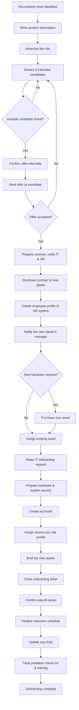

# Joiners (onboarding) procedure

> Part of the [docs-kit](../../README.md#before-you-rely-on-anything-here) — a Department-of-One starting point, not a certified or audit-ready control out of the box. Read that disclaimer and this artefact's own "Adapt this to your context" section before relying on it.

## Process

The Process is the end-to-end workflow across every function involved — recruitment, HR, and IT — shown at the altitude a Policy or Standard operates at. The Procedure below is the detailed IT/access checklist for one part of it. Some early steps (advertising a role, interviewing) sit outside a solo IT operator's remit and are shown only for context — the acceptance criteria below start from "an offer has been accepted."

## Acceptance criteria

- A ticket exists for the onboarding before any work starts on it.
- If the new starter's arrival is not yet public inside the organisation, check with the requester (usually the line manager) whether an internal announcement is wanted before any account invites go out — don't let the plumbing get ahead of the people news.
- Follow the organisation's email/username naming convention when creating the new account.
- Record the new user's access in the [Company Asset Register](../../registers/company-asset-register.md) — every system they're granted, with any elevated privilege clearly flagged.
- Provision access per the role-based access profile for their role, or as the line manager specifically advises. Don't provision "whatever the last person in the role had" without checking it's still current.
- Provide a device unless the person is an external contractor or service provider who'll use their own. Record the device assignment in the asset register. Keep the account **suspended in the identity provider** until the new starter's actual first day — don't activate early.

## Credential hygiene

This is the part that actually stops a new-joiner credential from being the weak point in the whole process:

- Issue passwords as a **one-time login password**, never a permanent one set by IT.
- Distribute the password through a channel other than email where possible (e.g. a password manager's secure share, or in person).
- Distribute the password **separately from the username** — never send both in the same message or channel (out-of-band delivery). If someone intercepts one, they still don't have the other.
- The password must differ from the associated username.

## Hardware pickup

Default: the new starter visits an office on day one to collect their hardware in person. Ship a device only if they're outside a reasonable distance from any office — shipping is the exception, not the default, because in-person handover is the cheapest available identity check for a piece of hardware that's about to be provisioned with real access.

## Closing out

- Confirm all access, device assignment, and elevated privileges are correctly recorded in the asset register before closing the ticket.
- Close the ticket only once the new starter has successfully logged in and changed their one-time password.

## Adapt this to your context

- **Remote-first organisations**: the day-one office visit default assumes a co-located workforce. For remote or distributed teams, shipping is the default, not the exception — replace the in-person handover's implicit identity check with an explicit one (e.g. a video call at first login, or a courier-signature requirement).
- **Regulated industries**: some sectors require a background check or security clearance to *complete before* access is provisioned, not just before the person starts — check whether your onboarding sequence needs re-ordering around that gate.
- **Size**: a solo operator collapses "line manager approval" and "IT provisioning" into one person. The checkpoint still matters even as a self-check — it's what stops a role profile being copied without re-checking it's still current.
