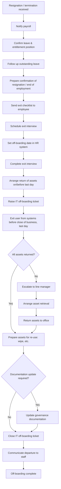

# Leavers (offboarding) procedure

> Part of the [docs-kit](../../README.md#before-you-rely-on-anything-here) — a Department-of-One starting point, not a certified or audit-ready control out of the box. Read that disclaimer and this artefact's own "Adapt this to your context" section before relying on it.

## Process

The Process is the end-to-end workflow spanning payroll, HR, and IT. The Procedure below is the IT-execution slice of it — the steps a solo operator actually runs.

The value in the procedure below is the **order** of operations and the **timing rules** — not the click-path through any particular identity provider's admin console. Whatever your stack is, the sequence below is what keeps a departure from leaving an open door behind.

## On notice of resignation or termination

Once IT is aware of a resignation or termination, work through this in order and record the outcome on the ticket:

1. **Create an offboarding ticket** if one doesn't already exist. Record the person's last working day clearly — every timing rule below hangs off that date.
2. **Remove all admin/elevated access immediately**, unless the line manager specifically instructs otherwise (e.g. a handover period). Admin access is the highest-blast-radius thing a departing person can still touch; it comes off first, before anything else.
3. **Remove licences and subscriptions** tied to the person, so seats aren't paid for or held open past their departure.
4. **Remove all remaining access** across every system the person had a login to.

## Identity provider account

- Follow your identity provider's own offboarding checklist for suspending and ultimately deleting the account (every provider has one; this procedure doesn't assume which one you use).
- **Email redirection**: redirect the departing person's email for a period of **no shorter than 90 days**. The default recipient is their team leader; if that's not workable, escalate the decision to whoever leads IT. Don't let a departing person's mailbox just vanish — someone external is still going to email it for months.
- **Data transfer**: transfer the departing person's files/drive data to their people leader (or a named delegate) before the account is deleted, so work product doesn't disappear with the account.
- **Service account check**: before deleting the account, check the [Company Asset Register](../../registers/company-asset-register.md) to see whether the departing person is the recorded **owner of a service account**. If they are, transfer ownership to a new named person first — a service account with no live owner is a liability that outlasts the person who created it, and it's easy to miss because service accounts don't show up in a normal user-access review.
- **Contractor accounts**: if the departing person is a contractor, check any group memberships for non-organisational accounts that were added alongside them, and remove those too.
- **Delete the account** once the above is done.
- **Remove any monitoring alerts** that were set up specifically to watch this person's account during the notice period, once offboarding is complete.

## Registers

- Update the [Company Asset Register](../../registers/company-asset-register.md): remove all user access entries, and update system-owner fields for anything the departing person owned.

## Hardware

- Confirm on the ticket that all organisation-owned devices are surrendered on or before the last working day — along with any physical keys, access cards, or door codes issued to them.
- Wipe the device and mark it available (or decommissioned, if end-of-life) in the asset register.
- Update the asset register's device-assignment entry to reflect the return.

## Adapt this to your context

- **Mailbox retention**: the 90-day redirect window is a reasonable default, not a fixed rule — your jurisdiction's employment or data-retention law, or your industry's record-keeping obligations, may require holding business correspondence longer.
- **Regulated data**: if the departing person had access to regulated data (health records, financial data, government data), your jurisdiction or sector may impose specific offboarding attestation or notification requirements beyond what's listed here — check before assuming this checklist is complete.
- **Contractors and service providers**: the account and access considerations here apply, but contract-termination and IP-handover obligations sit outside this procedure — check your contractor agreement for what else applies.
