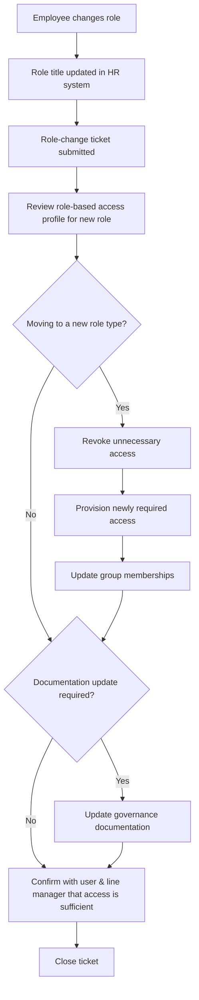

# Movers (role change) procedure

> Part of the [docs-kit](../../README.md#before-you-rely-on-anything-here) — a Department-of-One starting point, not a certified or audit-ready control out of the box. Read that disclaimer and this artefact's own "Adapt this to your context" section before relying on it.

## Process

## Acceptance criteria

A ticket must exist for the role change, carrying at minimum:

- Name
- New role
- New team
- Contact details
- Line manager's name
- Date the change takes effect from

Get the line manager's approval before making any access change.

## What actually changes

- Update the person's HR system of record to reflect the new role.
- Review the role-based access profile for the **new** role in the [Company Asset Register](../../registers/company-asset-register.md) to understand what access it needs.
- **Review the access the person holds today against what the new role needs.** This is the step that's easy to skip and shouldn't be: any access no longer required for the new role must be revoked, not left in place "just in case."
- Review group memberships across every system the person belongs to — identity/SSO groups, collaboration and messaging platforms, any system-specific role groups — to confirm they're still fit for purpose. A role change is the moment stale group membership actually gets caught; if you only ever add people to groups and never audit the change, this is where the drift compounds.
- Provision the new access the role requires.
- Tell the person what changed and why, especially if anything was revoked — a silent access removal reads as a mistake even when it's correct.
- Update the [Company Asset Register](../../registers/company-asset-register.md) to reflect the new access position.

## Closing out

Close the ticket once the register reflects the new access position and the person has confirmed they can do their job with it.

## Adapt this to your context

- **Segregation of duties**: regulated industries (financial services especially) may require a formal segregation-of-duties conflict check on a role change — not just an access diff against the old role. If your organisation has SoD rules, check the new access combination against them explicitly, not just against what the old role had.
- **Size**: a solo operator is often both the approver and the person making the change. Document the approval step anyway (even as a dated self-note) — it's what makes the decision reviewable later, not just rememberable.

**Frameworks referenced**: ISO/IEC 27001 Annex A's access-control objectives.
