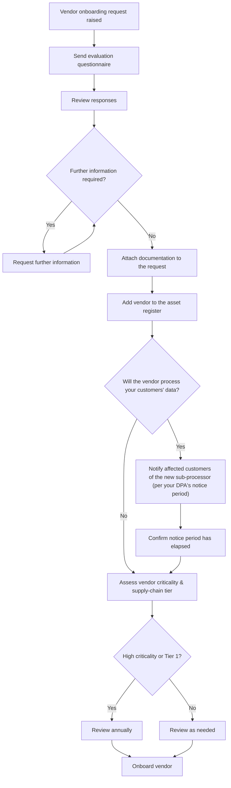

# Software onboarding & vendor due diligence procedure

> Part of the [docs-kit](../README.md#before-you-rely-on-anything-here) — a Department-of-One starting point, not a certified or audit-ready control out of the box. Read that disclaimer and this artefact's own "Adapt this to your context" section before relying on it.

The vendor check a solo IT operator runs before adding a new piece of software — proportionate to what the software actually touches, not a fixed checklist applied identically to a $10/month utility and a system holding customer data.

This procedure covers the *operational* onboarding check. The deeper, quantitative third-party risk model (CIA criticality × jurisdiction × adverse history, with a scored overall rating) that this check feeds into is security-team territory — see the companion [security-grc-kit](https://github.com/benguin5611/security-grc-kit) for that method once it's published. This kit ships the check; that one ships the scoring model behind it.

## Process

If your organisation is itself a service provider, adding a new vendor that will touch *your customers'* data usually carries its own notice obligation — most data-processing agreements require telling affected customers before a new sub-processor goes live, not after. Skip that branch entirely if you have no customer data flowing through vendors.

## 1. Request received

The requester submits a request (however you route requests — ticket, form, whatever), including:

- Purpose and business justification
- Whether it's a new or replacement solution
- Estimated cost (frequency, per-user/entity, number of users)
- Software type (SaaS, desktop, web, open source)
- Vendor details and a key contact
- Data sensitivity and access requirements
- Licensing terms and pricing, if applicable

## 2. Preliminary suitability check

- Review for business relevance and duplication with existing tools.
- Do a quick financial sanity check on the justification.
- Check for obvious security or compliance red flags — poor reputation, unsupported software, known unpatched vulnerabilities.

## 3. Asset classification

Rate the software's Confidentiality, Integrity, and Availability impact individually — Low, Medium, High, or Critical — based on the potential impact if each is compromised, and assign an overall sensitivity rating based on what the software will process, access, or store.

| Category | Rating |
| --- | --- |
| Confidentiality | |
| Integrity | |
| Availability | |
| CIA impact (overall) | |
| Information/system sensitivity | |
| Information security criticality | |

## 4. Security and compliance assessment

**For all software**: review available documentation on encryption, access control, authentication methods (SSO, MFA), data handling, privacy policy, and retention.

**For critical software**: contact the vendor and request either an ISO 27001 and/or SOC 2 Type II certification, or completion of a supplier evaluation questionnaire. If nothing is provided on modern-slavery exposure and it isn't otherwise apparent, run an adverse-media search. Then assess what you get back:

| Documentation type | Summary of findings | Gaps or limitations | Notes / compensating controls |
| --- | --- | --- | --- |
| SOC 2 report | | | *e.g. Availability not covered by SOC 2, but addressed through documented DR capability and regional failover* |
| ISO/IEC 27001 Statement of Applicability | | | |
| BCP / DR / resilience evidence | | | |
| Other certifications (e.g. ISO 22301) | | | |
| Vendor website / public documentation | | | |
| Customer User Entity Controls (CUECs) | | | |

**For open-source software specifically**, before moving to approval:

1. Review the project's documentation for architecture, design, and security practice — how it handles sensitive information, encryption, access control, and data protection.
2. Assess the maintaining team's expertise, responsiveness to security issues, and the size/activity of the community around the project. A larger, active community is a proxy for more rigorous practice, not a guarantee of it.
3. Check whether the project has a formal vulnerability-management process — how issues get reported, patched, and released — and whether patches actually land promptly.
4. Do a code review, or check existing third-party audits if available, for insecure practices (missing input validation, poor handling of user input).
5. Check the project's security track record — prior incidents, disclosed vulnerabilities, and how they were handled.
6. Identify its dependencies and their security track record — a vulnerability in a dependency is a vulnerability in the project.
7. Check whether it undergoes regular security testing (pen testing, vulnerability scanning) or holds third-party certifications.
8. Check user community feedback and forums for reported security concerns.
9. Confirm the project is actively maintained with a working support channel.
10. Confirm it complies with relevant legal/regulatory requirements — data protection law, licensing, industry standards — and review its privacy policy and terms of use.
11. Confirm the licence is genuinely open source (check it against the [Open Source Initiative's licence list](https://opensource.org/licenses/)).
12. Consult the Information Security Manager for a final determination.

Open-source projects used internally are generally not treated as Tier 1 suppliers in the same sense as a paid vendor, but the due-diligence steps above still apply.

## 5. Approval and documentation

Urgent or trial software use may proceed under **provisional approval** — time-limited access, with the full review completed on an expedited basis rather than skipped.

**If approved:**

1. Attach any completed questionnaires or certifications to the request.
2. File the supporting documentation somewhere durable and findable.
3. Add the software to the [Company Asset Register](../registers/company-asset-register.md) — systems tab, and the vendor to the supplier tab if applicable.
4. Grant user access and record it in the register.
5. Implement any required app authorisation or allowlisting (e.g. OAuth client approval).
6. Complete any required configuration.
7. Close the request once onboarding is complete and the register is updated.

**If rejected:** document the rationale, give the requester feedback, and close the request.

## Adapt this to your context

- **Sub-processor notice**: the customer-notice branch in the Process diagram above only applies if you're a service provider with customer data flowing through vendors. What counts as adequate notice (how many days, what format) is set by your data-processing agreements, not this procedure — check what you've actually committed to before assuming a number.
- **Government vs non-government suppliers**: private-sector SaaS commonly evidences itself with SOC 2 or an ISO 27001 Statement of Applicability. A government supplier or a vendor selling into government may instead hold (or need) a government-specific assessment — e.g. Australia's IRAP, or the US's FedRAMP — which isn't a drop-in substitute for the private-sector evidence types listed above; check what's actually expected in your context.
- **Depth of diligence should scale with the CIA/criticality rating**, not be applied identically to every vendor. A Critical-rated vendor handling regulated data warrants a full formal assessment; the provisional-approval path for urgent/trial use should never be the route for that tier regardless of time pressure.
- **Industry**: some sectors carry additional mandatory vendor-assessment obligations (e.g. anti-money-laundering "Tranche" obligations, health-data handling rules, payment-card-industry scope) that this generic checklist doesn't cover — check your sector's specific requirements on top of this.

**Frameworks referenced** (by family — check current editions): ISO/IEC 27001 (Statement of Applicability), SOC 2 (Trust Services Criteria), the Open Source Initiative's licence list.
