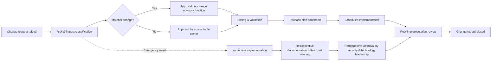

# Change management process

> Part of the [docs-kit](../README.md#before-you-rely-on-anything-here), a Department-of-One starting point, not a certified or audit-ready control out of the box. Read that disclaimer and this artefact's own "Adapt this to your context" section before relying on it.

A *Process* is the input to sub-process to output workflow: the cross-functional shape of how a change actually moves from idea to production. That's distinct from the [Change Management Standard](../standards/change-management-standard.md)'s per-control must/should rules and the [Change Communication Guide](../references/change-communication-guide.md)'s stakeholder-messaging rules.

## Process flow

## Sub-process detail

**Change request raised.** Anyone who identifies a need for change (a patch, a configuration update, a new feature, an infrastructure change, or a process adjustment) raises it as a standard change record. That record captures what's changing, why, and a first-pass view of the risk. Artefact: change request record.

**Risk and impact classification.** The request is assessed for its potential effect on the confidentiality, integrity, and availability of the systems and data it touches, and assigned a risk tier. This classification determines how much scrutiny, and how many approvers, the change needs from here on. Artefact: risk/impact classification attached to the change record.

**Approval, scaled by risk tier.** Routine, low-risk changes can be signed off by a single accountable owner. Changes with a material effect on functionality, performance, security, or user-facing behaviour route through a broader review: a change advisory function, or a nominated pair of senior stakeholders, who confirm the risk has genuinely been considered and that anyone with a stake in the outcome (including whoever is responsible for security) has had visibility. Artefact: approval record naming the approver(s) and date.

**Testing and validation.** Before anything reaches production, the change is tested in an environment that isn't the live system, proportionate to risk. A rollback plan is written or confirmed at the same time, so there's a defined way back out if the change misbehaves. Artefacts: test evidence, rollback plan.

**Scheduled implementation.** The change is deployed at an agreed time, respecting any active change-freeze windows around high-risk periods (audits, major releases, period-end close) during which only emergency changes proceed. Artefact: implementation record with timestamp.

**Post-implementation review and closure.** Once the dust has settled, someone confirms the change achieved what it set out to do, captures any lessons learned, and closes the record. Higher-risk or recurring changes can roll up into periodic reporting to leadership on change volume, success rate, and any incidents traced back to change. Artefact: review note, closed change record.

**Emergency path.** When a change must bypass the normal approval flow because of genuine operational urgency, an active outage or active security incident, for example, it goes straight to implementation. Within a short, fixed window afterwards, it must be documented retrospectively: what happened, why it was urgent, and what the risk and impact were. It is then formally reviewed and approved after the fact by whoever holds ultimate accountability for security and technology risk, before rejoining the normal flow at post-implementation review.

## Adapt this to your context

- In a one-person operation, "approval" becomes self-attestation for low-risk changes. Write the change record before you make the change, not after, with a clear, named risk threshold (for example, anything touching customer data, external-facing infrastructure, or authentication) above which you deliberately pause and get a second opinion from a peer, contractor, or advisor rather than approving yourself.
- As the team grows, move from self-attestation to a genuine second approver for anything above the low-risk threshold, and stand up a lightweight change advisory function once change volume makes ad hoc approval unworkable.
- Regardless of size, keep risk classification, approval record, test evidence, and rollback plan attached to the *same* change record. A process that scales well is one where the paperwork doesn't scatter as more people get involved.
