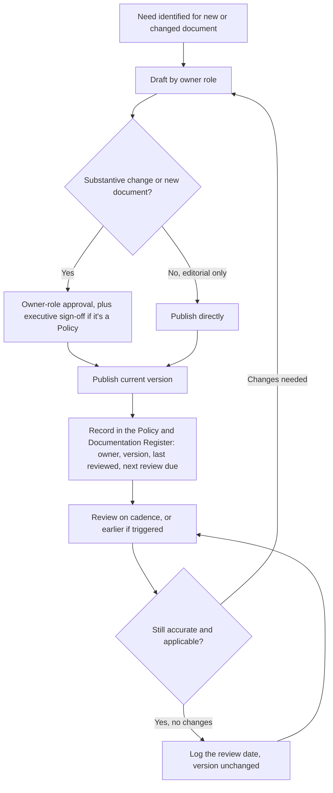

# Document control process

> Part of the [docs-kit](../README.md#before-you-rely-on-anything-here), a Department-of-One starting point, not a certified or audit-ready control out of the box. Read that disclaimer and this artefact's own "Adapt this to your context" section before relying on it.

Without some minimal control, a documentation estate degrades into contradictory copies, no record of what a policy actually said on a given date, and no clear owner when something's out of date. This process sets out how a document gets created, approved, reviewed, and eventually superseded, proportionate to a one-person operation rather than a formal document-control committee.

## Naming and structure

Organise documents by layer, not by a flat numbered list: policy, standard, process/procedure, register, or reference (see the docs-kit's own [documentation model](../README.md#the-documentation-model) for what each layer answers). File and title names are descriptive and consistent (kebab-case filenames matching plain-English titles), so a document is findable by what it's about rather than by memorising an ID scheme.

If your organisation wants short reference codes for citing documents in tickets, audits, or contracts without pasting full titles, a simple prefix-plus-sequence scheme per layer works (policy, standard, process, reference, register), but treat it as a label on top of the descriptive name, not a replacement for it.

## Ownership and approval

Every document carries an **Owner role**: the role responsible for its accuracy, not necessarily a named individual. In a department of one, the same person may hold several owner roles at once. Naming the role rather than the person keeps the document correct as the organisation and its staffing changes.

- **New documents and substantive changes** (anything that changes scope, adds or removes an obligation, or changes a process step) need sign-off from the owner role. Policies, being executive-sponsored, additionally need sign-off from that executive sponsor.
- **Editorial changes** (typo fixes, broken links, formatting, rewording that doesn't change meaning) don't need a full re-approval cycle. Make the fix and note it happened. Don't let minor housekeeping block on the same approval path as a substantive change.

## Review cadence

Each document's frontmatter carries a **Review cadence** (annual, for most of this kit). A review means re-reading the document, confirming it's still accurate and still applicable, and recording that the review happened, even when nothing changes. An unreviewed document and a reviewed-and-still-correct document look identical on the page. Only the review record tells them apart, and only the first one is a real gap.

Trigger a review outside the normal cadence when:
- An incident, audit, or near-miss exposes a gap in what the document says.
- A regulatory or contractual obligation the document reflects changes.
- The underlying tool, system, or process the document describes changes materially.

## Versioning and retention

Bump the version number on every substantive change; treat editorial fixes as not requiring a version bump (or a minor one, if your tooling tracks that automatically). Whatever the scheme, the point is being able to answer "what did this document say on this date," not just "what does it say now."

Retain superseded versions rather than deleting them. Version control (git history, or your source of truth's built-in revision history) is normally sufficient for this on its own. The failure mode to avoid is a document that only exists in its current form, with prior versions lost to manual overwrites or files renamed "-v2-final" and then abandoned in someone's downloads folder.

## The register

Individual documents shouldn't have to be found by browsing folders. A [Policy and Documentation Register](../registers/policy-and-documentation-register.md), one place listing every artefact, its owner role, current version, last review date, and next review due date, is what turns a folder of files into something you can actually govern. It's also the difference between "we have policies" and "we can show which policy applied on the day something happened," which is what an auditor, regulator, or customer due-diligence questionnaire is actually asking for.

## Adapt this to your context

- **Register first, tooling second.** The register is the load-bearing part of this process. A spreadsheet or a table in your wiki is a perfectly adequate register for a department of one. Don't wait for a dedicated GRC platform before starting one.
- **Escalation path for policies.** If there's no separate "executive sponsor" role in your organisation yet, the owner role and the approver may be the same person for now. Say so plainly in the register rather than implying a governance layer that doesn't exist.
- **Regulatory retention minimums.** Some frameworks and contracts specify a minimum retention period for superseded versions of controlled documents (commonly several years). Check what applies to you rather than relying on "keep it in git forever" as a default policy.
