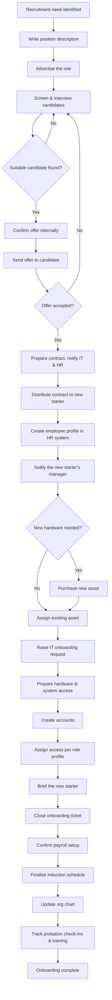

# Joiners (onboarding) process

> Part of the [docs-kit](../../README.md#before-you-rely-on-anything-here), a Department-of-One starting point, not a certified or audit-ready control out of the box. Read that disclaimer before relying on it.

This is the end-to-end workflow across every function involved: recruitment, HR, and IT, shown at the altitude a policy or standard operates at. The [Joiners procedure](../../procedures/joiners-movers-leavers/joiners.md) is the detailed IT and access checklist for one part of it. Some early steps (advertising a role, interviewing) sit outside a solo IT operator's remit and are shown only for context. The procedure's acceptance criteria pick up once an offer has been accepted.

## Adapt this to your context

- A solo operator collapses several of these boxes (recruitment, HR, IT) into one person. The workflow still matters as a checklist of what has to happen and in what order, even when one person is doing all of it.
