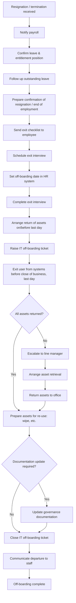

# Leavers (offboarding) process

> Part of the [docs-kit](../../README.md#before-you-rely-on-anything-here), a Department-of-One starting point, not a certified or audit-ready control out of the box. Read that disclaimer before relying on it.

The end-to-end workflow spanning payroll, HR, and IT. The [Leavers procedure](../../procedures/joiners-movers-leavers/leavers.md) is the IT-execution slice of it: the steps a solo operator actually runs.

The value in the linked procedure is the order of operations and the timing rules, not the click-path through any particular identity provider's admin console. Whatever your stack is, that sequence is what keeps a departure from leaving an open door behind.

## Adapt this to your context

- A solo operator runs every box in this diagram personally. Naming the steps still matters: it's what a stand-in or successor would need to follow if you were unavailable when someone left.
