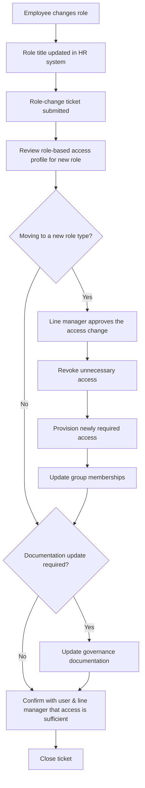

# Movers (role change) process

> Part of the [docs-kit](../../README.md#before-you-rely-on-anything-here), a Department-of-One starting point, not a certified or audit-ready control out of the box. Read that disclaimer before relying on it.

The end-to-end workflow for a role change, from the HR system update through to closing the ticket. The [Movers procedure](../../procedures/joiners-movers-leavers/movers.md) is the detailed access-diff checklist that sits inside it.

## Adapt this to your context

- A solo operator is often both the approver and the person making the change. Document the approval step anyway, even as a dated self-note, so the decision is reviewable later rather than only rememberable.
