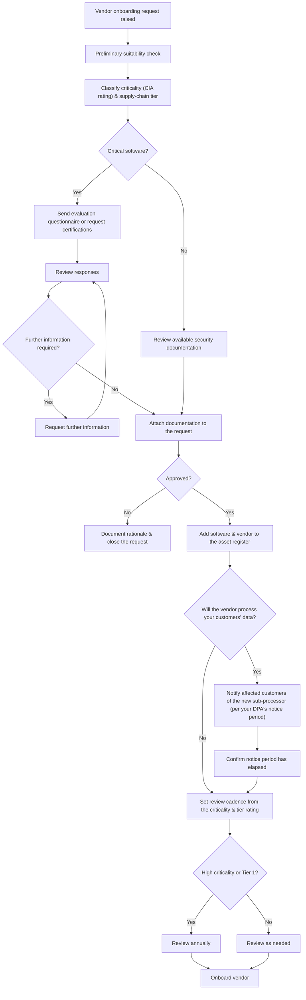

# Software onboarding and vendor due diligence process

> Part of the [docs-kit](../README.md#before-you-rely-on-anything-here), a Department-of-One starting point, not a certified or audit-ready control out of the box. Read that disclaimer before relying on it.

The end-to-end workflow for adding a new piece of software, from request through to onboarding. The [Software Onboarding & Vendor Due Diligence procedure](../procedures/software-onboarding-and-vendor-due-diligence-procedure.md) is the detailed checklist for each stage.

If your organisation is itself a service provider, adding a new vendor that will touch your customers' data usually carries its own notice obligation. Most data-processing agreements require telling affected customers before a new sub-processor goes live, not after. Skip that branch entirely if you have no customer data flowing through vendors.

## Adapt this to your context

- The customer-notice branch above only applies if you're a service provider with customer data flowing through vendors. What counts as adequate notice (how many days, what format) is set by your data-processing agreements, not this diagram: check what you've actually committed to before assuming a number.
